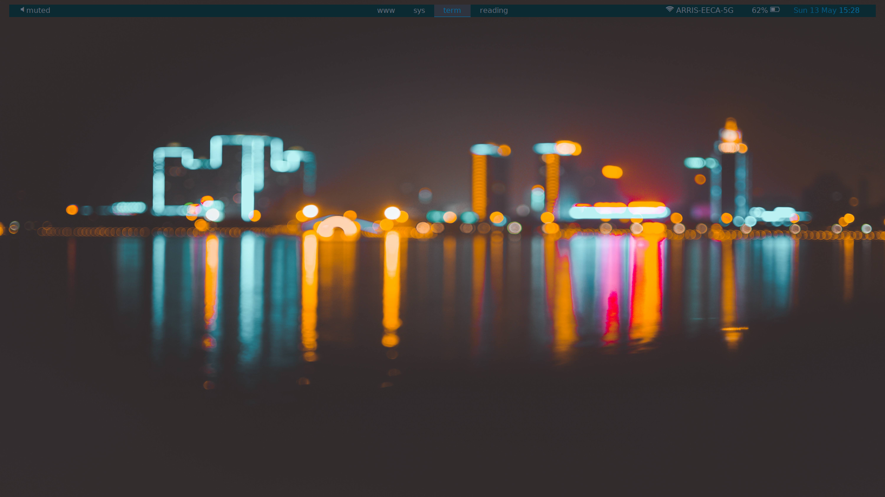

# i3-work

## Theme for `i3-gaps` and `polybar` for work

First "rice", but it really is just a mash of other peoples
projects with some customization.

This has everything set up the way I like for working with a
tiling window manager. Different workspaces for different tasks,
and integration (somewhat) between `polybar` and `i3-gaps`.

I've replaced `dmenu` with `rofi`, but no extra customization.

## Dependencies

Requires:

- [`i3`]
- [`i3-gaps`](https://github.com/Airblader/i3)
- [`polybar`](https://github.com/jaagr/polybar)
- [`rofi`](https://github.com/DaveDavenport/rofi)
- [`wal`](https://github.com/dylanaraps/pywal)
- [`feh`]

including the dependencies of each of the above packages (e.g. `wal` needs
Python, and `polybar` has five million dependencies.)

## Installation

1. Install i3 with `sudo apt install i3`, or equivalent

2. Clone the `i3-gaps` git, compile, and install into `/usr/local/bin`

3. Clone the `polybar` git, compile, and install all the damn dependencies

4. Install `rofi` with `sudo apt install rofi`

5. Install PyWal via `pip install pywal`

6. Finally, clone this repo and copy the contents into `$HOME/.config/`

## Bugs

### Polybar not starting

I've found  that `polybar` does not start on launch. For now I've been calling it
on startup with `rofi`...

### PyWal colours not working properly

Need to include `wal -qtRn` in `.bashrc`. The `-R` option repeats the previous setting,
the `-n` ensures that the wallpaper can be set independently, and `-q` is quiet.

